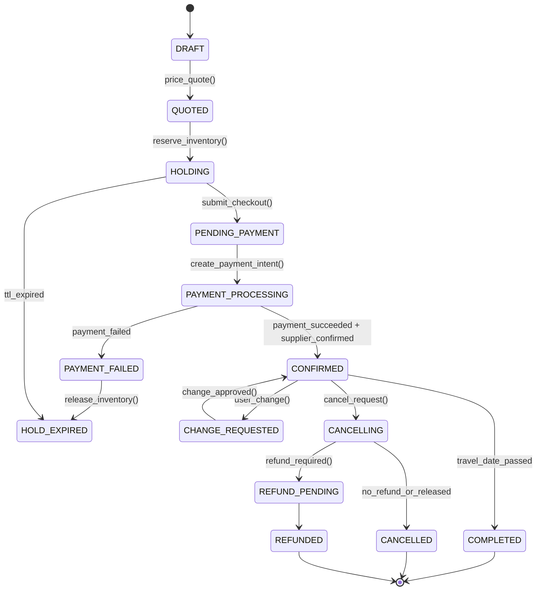
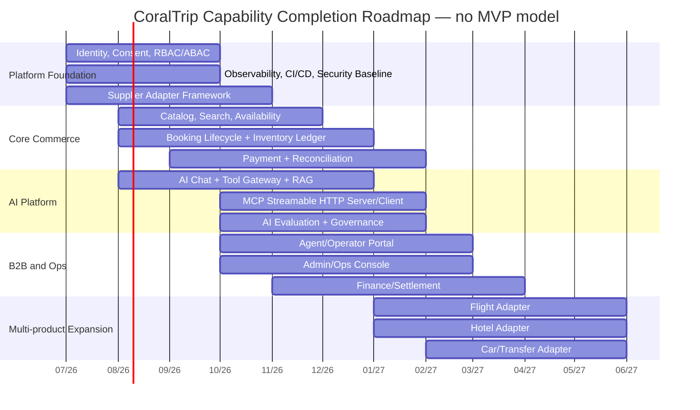

# CoralTrip Assistant Agent — Product Requirements Document v2.0

> **Loại tài liệu:** Product Requirements Document (PRD)  
> **Phiên bản:** v2.0 — Full-scope Review & Verified Update  
> **Ngày cập nhật:** 03/07/2026 — Asia/Ho_Chi_Minh  
> **Trạng thái:** Revised after audit; bỏ mô hình MVP/v1/v2; triển khai theo capability + user-story completion gate  
> **Đối tượng:** Founder · Product · Engineering · Operations · Legal/Compliance · Partnerships  
> **Ngôn ngữ:** Tiếng Việt

---

## 0. Changelog v2.0

| Nhóm thay đổi | Nội dung cập nhật |
|---|---|
| Chiến lược triển khai | Hủy cách chia `MVP → v1 → v2`. Thay bằng mô hình **full-scope product roadmap theo capability**, mỗi capability được release khi các user story liên quan đạt Definition of Done, SLO và compliance gate. |
| Market sizing | Sửa nhận định “OTA Việt Nam 8 tỷ USD năm 2025” thành khoảng kiểm chứng: nhiều nguồn đưa 2025 vào khoảng 2,87–5,0 tỷ USD; một số nguồn dự báo online travel có thể đạt khoảng 8 tỷ USD vào 2030. |
| North Star | Bổ sung North Star rõ hơn: **Weekly Contribution-Positive Confirmed Trips (WCPCT)**. Metric này chỉ tính booking đã xác nhận, có đóng góp biên dương, chưa bị hủy trong cửa sổ rủi ro, và có ít nhất một tương tác AI/decision-support có ý nghĩa. |
| Unit economics | Bổ sung mô hình GTV → Net Revenue → Contribution Margin → CAC ceiling → Payback. Tách assumption cần kiểm chứng khỏi số liệu đã xác minh. |
| Supplier/API strategy | Flight/hotel/car/transfer đều đi qua **Supplier Adapter Layer**. Adapter là hợp đồng kỹ thuật bắt buộc, không hard-code theo Amadeus/Booking.com/Agoda/VNPay/MoMo. |
| AI/MCP | Chỉnh “HTTP+SSE” thành **MCP Streamable HTTP**, giữ SSE là cơ chế stream optional theo spec. Bổ sung security gate: Origin validation, auth bắt buộc, session-id handling, rate limit, audit log. |
| Compliance | Cập nhật yêu cầu Nghị định 13/2023/NĐ-CP: consent rõ ràng, log xử lý dữ liệu, nhân sự/bộ phận bảo vệ dữ liệu, breach notification theo Điều 23, và SLA xử lý quyền dữ liệu cần được pháp chế xác nhận theo từng quyền. |
| Scope | Bổ sung B2C, B2B agent, tour operator, admin, supplier management, finance/reconciliation, AI governance, trust & safety. |

---

## 1. Tóm tắt điều hành

CoralTrip Assistant Agent là nền tảng du lịch số cho thị trường Việt Nam và Đông Nam Á, kết hợp **tour package, flight, hotel, car/transfer, booking operations và AI concierge** trong một trải nghiệm thống nhất. Sản phẩm được thiết kế như một platform dài hạn, không đi theo hướng “làm MVP tối giản”, mà triển khai từng **user story hoàn chỉnh** với tiêu chí rõ về nghiệp vụ, hiệu năng, độ tin cậy, bảo mật, pháp lý và vận hành.

Vấn đề CoralTrip giải quyết là sự phân mảnh trong hành trình mua du lịch: người dùng phải tự so sánh ở nhiều nền tảng, hỏi thủ công qua Zalo/Facebook, tự ghép lịch trình, tự kiểm tra chính sách hủy/visa/thời tiết và thiếu một lớp tư vấn đáng tin cậy. Với đại lý và nhà cung cấp, vấn đề là dữ liệu booking phân tán, cập nhật chỗ thủ công, thiếu audit, thiếu reconciliation và thiếu công cụ AI hỗ trợ bán hàng.

Định vị sản phẩm:

- **B2C:** AI-assisted travel booking platform cho người dùng tự lên kế hoạch và đặt dịch vụ.
- **B2B Agent:** dashboard quản lý khách, quote, booking, payment, voucher, commission.
- **Tour Operator/Supplier:** portal quản lý catalog, allotment, giá, policy, inventory và reconciliation.
- **Admin/Ops:** hệ thống vận hành end-to-end: booking lifecycle, refund, dispute, audit, manual override, escalation.
- **AI Platform:** AI concierge, RAG policy/FAQ/visa, tool calling, MCP server/client và AI governance.

### 1.1 North Star Metric

**North Star:** `Weekly Contribution-Positive Confirmed Trips (WCPCT)`

Một trip được tính vào WCPCT khi thỏa mãn tất cả điều kiện:

1. Booking đã ở trạng thái `CONFIRMED` hoặc `TICKETED`.
2. Thanh toán thành công hoặc đối soát B2B xác nhận công nợ.
3. Không nằm trong trạng thái chargeback, fraud review, forced refund hoặc cancellation risk chưa đóng.
4. Contribution margin sau payment fee, supplier commission, LLM cost, support cost, voucher/SMS/email cost và refund reserve là số dương.
5. Có ít nhất một sự kiện AI/decision-support có ý nghĩa trong hành trình: AI search, itinerary planning, policy explanation, comparison, quote generation hoặc assisted checkout.

**Lý do chọn:** metric này tránh tối ưu sai theo “booking số lượng nhiều nhưng lỗ”, đồng thời gắn được ba giá trị cốt lõi: người dùng hoàn tất chuyến đi, AI thật sự hỗ trợ ra quyết định, và đơn hàng có lợi nhuận đóng góp.

### 1.2 KPI tree

| Level | Metric | Ý nghĩa | Công thức / Ghi chú |
|---|---|---|---|
| North Star | WCPCT | Số trip xác nhận có contribution dương/tuần | Count trip đạt 5 điều kiện ở trên |
| Growth | Qualified Search Sessions | Phiên tìm kiếm có intent rõ | Search/chat có destination + date/budget/pax |
| Activation | AI Planning Completion Rate | AI giúp user hoàn tất plan | Completed itinerary / AI planning sessions |
| Conversion | Search-to-Draft Booking | Từ tìm kiếm sang booking draft | Draft bookings / qualified sessions |
| Conversion | Draft-to-Paid | Từ draft sang thanh toán | Paid bookings / draft bookings |
| Revenue | Net Revenue | Doanh thu ròng | GTV × take rate - refunds/discounts |
| Profitability | Contribution Margin/Trip | Lợi nhuận đóng góp | Net revenue - variable costs |
| Retention | Repeat Trip Rate 180d | Khách quay lại đặt | Returning confirmed bookers / total bookers |
| Trust | Policy Accuracy Rate | AI trả lời đúng policy | AI policy answers passed eval / total sampled |
| Ops | Manual Intervention Rate | Mức phụ thuộc vận hành thủ công | Manual ops cases / total bookings |

---

## 2. Bối cảnh thị trường và cơ hội

### 2.1 Market sizing đã kiểm chứng

Không nên dùng một con số duy nhất cho thị trường online travel Việt Nam vì các báo cáo khác nhau về scope: OTA only, travel & tourism online, gross booking value, hotel/flight/tour combined, hoặc broader travel economy.

| Nguồn | Claim liên quan | Cách dùng trong PRD |
|---|---|---|
| Mordor Intelligence | Vietnam Online Travel Market: USD 2,87B năm 2025; USD 3,12B năm 2026; dự báo USD 4,69B năm 2031, CAGR 8,55%. | Dùng làm estimate thận trọng cho online travel market. |
| WiT trích Google e-Conomy SEA | Online travel Việt Nam khoảng USD 4B năm 2025, có thể tăng lên USD 8B năm 2030. | Dùng làm optimistic scenario, không ghi 8B là số 2025. |
| Reuters / Bộ VHTTDL | Việt Nam vượt mốc 20M khách quốc tế trong năm 2025; tăng 19,3% so với năm trước và vượt kỷ lục 2019. | Dùng để chứng minh tourism demand phục hồi mạnh. |
| Booking.com Developers | Demand API dành cho Managed Affiliate Partner, cần API key token + affiliate ID. | Dùng để xác định dependency/partner risk. |
| Amadeus Developers | Self-Service APIs hỗ trợ flight search/booking/hotel/destination; Flight Create Orders tạo booking reference. | Dùng để xác định supplier adapter cho flight. |

**Kết luận market:** cơ hội có thật, nhưng luận điểm cạnh tranh không nên là “thị trường rất lớn” mà là **AI-assisted conversion + local tour supply + B2B operations automation**.

### 2.2 Competitive position

| Nhóm đối thủ | Điểm mạnh | Điểm CoralTrip cần khác biệt |
|---|---|---|
| OTA lớn: Traveloka, Agoda, Booking.com | Brand mạnh, inventory lớn, payment/ops mature | Không đấu bằng giá/ads ngay; đấu bằng itinerary tư vấn, local tour, nhóm gia đình/người cao tuổi, B2B agent workflow. |
| Activity marketplace: Klook, GetYourGuide, Tiqets | Catalog activity tốt, UX mua vé nhanh | CoralTrip cần khác biệt ở package tour + multi-day planning + supplier operations. |
| Meta-search: Google Flights, Skyscanner | Search mạnh, so sánh nhanh | CoralTrip phải đóng vòng booking và hậu mãi, không chỉ dẫn traffic đi nơi khác. |
| Local agency/Zalo/Facebook | Quan hệ địa phương, tư vấn linh hoạt | CoralTrip product hóa quy trình tư vấn, quote, booking, payment, voucher, audit. |
| AI trip planner độc lập | UX chat hay, tạo itinerary nhanh | CoralTrip cần inventory thật, giá thật, booking thật, policy thật, không chỉ “gợi ý du lịch”. |

### 2.3 Strategic wedge

CoralTrip nên đi theo wedge sau:

1. **AI-assisted tour package booking** là lõi doanh thu và khác biệt ban đầu.
2. **Supplier Adapter Layer** cho phép gắn flight/hotel/car sau mà không phá domain.
3. **B2B Agent/Ops Console** giúp chuyển từ sản phẩm consumer sang nền tảng vận hành.
4. **MCP Server** biến CoralTrip thành tool provider cho agent ecosystem, không chỉ là app.

---

## 3. Personas, Jobs-to-be-Done và user stories cấp cao

### 3.1 Personas

| Persona | Mục tiêu | Pain chính | Success moment |
|---|---|---|---|
| Traveller cá nhân/gia đình | Tìm chuyến đi phù hợp ngân sách, lịch, người đi | Phải hỏi nhiều nơi; sợ giá/policy sai; khó so tour | Nhận itinerary + giá + chỗ còn + policy rõ, đặt trong một flow. |
| Group Planner | Tổ chức chuyến đi nhóm 8–30 người | Chốt số lượng chậm, chia tiền khó, thay đổi liên tục | Có quote, deadline giữ chỗ, split payment/cọc, quản lý pax. |
| Travel Agent | Tạo quote nhanh, quản lý booking/commission | Excel/Zalo dễ sai, thiếu dashboard | Tạo booking/quote/voucher nhanh, thấy commission và công nợ. |
| Tour Operator/Supplier | Bán qua kênh số, cập nhật allotment/giá | Phụ thuộc OTA, cập nhật thủ công | Upload catalog, quản lý allotment, nhận booking, đối soát. |
| Admin/Ops | Kiểm soát booking lifecycle và xử lý sự cố | Khó trace ai sửa gì, payment/refund không khớp | Có audit trail, manual override, SLA, reconciliation. |
| Finance | Đối soát payment, refund, commission | Lệch số liệu giữa payment gateway, supplier và booking | Có settlement report, ledger và exception queue. |
| AI Governance/Compliance | Kiểm soát rủi ro AI & dữ liệu | Hallucination, leak PII, tool misuse | Có eval, guardrail, redaction, consent, deletion workflow. |

### 3.2 Epic map

| Epic ID | Epic | Mục tiêu |
|---|---|---|
| E01 | Identity & Consent | Đăng ký, đăng nhập, phân quyền, consent, profile, privacy rights. |
| E02 | Catalog & Supplier Content | Quản lý tour/service catalog, media, policy, itinerary, SEO. |
| E03 | Search & Discovery | Search/filter/sort/recommendation, availability-aware ranking. |
| E04 | AI Travel Assistant | Chat, planning, comparison, RAG policy/visa, tool calling, itinerary builder. |
| E05 | Booking Lifecycle | Draft → hold → payment → confirmed/ticketed → change/cancel/refund/completed. |
| E06 | Payment & Reconciliation | Payment intent, webhook, ledger, refund, split payment, B2B invoice. |
| E07 | Supplier Adapter Layer | Chuẩn hóa kết nối tour/flight/hotel/car/payment/notification provider. |
| E08 | Agent & Operator Portal | B2B dashboard, quote, allotment, upload, commission. |
| E09 | Admin/Ops Console | Audit, escalation, manual override, SLA, fraud/risk review. |
| E10 | Trust, Safety & Compliance | Data protection, policy accuracy, AI eval, moderation, audit retention. |
| E11 | Observability & Reliability | SLO, tracing, metrics, alert, incident response, capacity. |
| E12 | Analytics & Unit Economics | Funnel, cohort, contribution margin, CAC, LTV, supplier performance. |

---

## 4. Product scope theo capability, không theo MVP

### 4.1 Capability completion rule

Một capability chỉ được xem là “xong” khi đạt đủ 6 gate:

1. **Product Gate:** user story, acceptance criteria, UX state, error state, empty state, i18n copy đã rõ.
2. **Domain Gate:** aggregate/invariant/domain event/API contract đã xác định.
3. **Technical Gate:** load test, idempotency, concurrency, failure mode, rollback, migration đã qua review.
4. **Security Gate:** authz/authn, PII handling, secrets, audit log, OWASP check đã qua review.
5. **AI Gate nếu liên quan:** eval set, hallucination guard, tool confirmation, prompt injection test, human escalation.
6. **Ops Gate:** dashboard, alert, runbook, manual override, reconciliation/backfill nếu cần.

### 4.2 Capability list

| Capability | Core output | Bắt buộc chịu tải cao |
|---|---|---|
| Tour catalog | Tour, departure, policy, itinerary, media, supplier mapping | Cache hot catalog, DB index, CDN image, search index. |
| Availability & pricing | Real-time availability, price quote, hold TTL | Inventory ledger, optimistic locking, Redis cache, supplier fallback. |
| Booking lifecycle | Draft, hold, payment, confirm, cancel, refund, complete | Idempotency, state machine, outbox, saga, retry, dead-letter. |
| AI planning | Conversational search, itinerary, comparison, policy Q&A | Streaming, model router, tool gateway, RAG cache, rate limit. |
| Supplier adapters | Flight/hotel/car/tour/payment/notification adapters | Circuit breaker, timeout, bulkhead, retry budget, adapter SLA. |
| B2B portal | Agent/operator/admin workflows | RBAC/ABAC, audit, batch operations, export. |
| Finance/reconciliation | Ledger, settlement, commission, refund matching | Immutable ledger, reconciliation job, exception queue. |
| Compliance | Consent, data subject rights, retention, DPIA | Audit log, deletion/anonymization workflow, DLP/redaction. |

---

## 5. Feature requirements

### 5.1 Tour Packages

| ID | Feature | Requirement | Acceptance Criteria |
|---|---|---|---|
| TP-01 | Tour Browse | User xem danh sách tour theo destination/date/budget/duration/theme. | Filter state shareable bằng URL; p95 render <1,5s; search API p99 <400ms khi dùng search index. |
| TP-02 | Tour Detail | Itinerary ngày-từng-ngày, ảnh, map, policy, FAQ, review, inclusion/exclusion. | Có structured policy; tối thiểu 5 ảnh; có availability widget; policy versioned. |
| TP-03 | Departure Calendar | Lịch khởi hành có giá, chỗ còn, trạng thái. | Real-time hoặc near-real-time; không oversell; có trạng thái sold-out/limited. |
| TP-04 | Compare Tours | So sánh 2–4 tour. | Sticky comparison; share link; AI explain difference. |
| TP-05 | Group Booking | Booking nhóm, cọc, split payment, pax management. | Hold TTL; payment schedule; quote versioning; operator approval. |
| TP-06 | Voucher | PDF/QR voucher, gửi email/Zalo/SMS. | Sinh trong <30s; QR signed token; verify endpoint. |
| TP-07 | Change/Cancel | Đổi ngày/hủy theo policy. | Policy engine; refund quote trước khi hủy; audit trail. |
| TP-08 | Review & Feedback | Review sau chuyến đi. | Chỉ verified traveller được review; anti-spam; moderation. |

### 5.2 AI Travel Assistant

| ID | Feature | Requirement | Safety/Trust Requirement |
|---|---|---|---|
| AI-01 | Multi-turn chat | Tiếng Việt/Anh, nhớ context trong session, hiểu reference. | Không bịa tour/giá; khi recommend bắt buộc tool call hoặc nguồn catalog. |
| AI-02 | AI search_tour | Parse intent và gọi search tool. | Tool call traceable; confidence thấp thì hỏi lại. |
| AI-03 | Itinerary planner | Tạo lịch trình ngày-từng-ngày từ catalog và user constraints. | Tách rõ “confirmed inventory” và “suggestion only”. |
| AI-04 | Policy/visa RAG | Trả lời policy, hoàn hủy, visa, hành lý, checklist. | Luôn cite policy version/source; nếu policy thiếu thì escalate. |
| AI-05 | Assisted booking | Tạo draft booking qua chat. | Mọi hành động tài chính phải có confirm UI, không auto-charge. |
| AI-06 | Comparison explainer | Giải thích tour nào phù hợp hơn. | Dựa trên criteria người dùng và dữ liệu catalog thật. |
| AI-07 | Memory | Ghi nhớ preference nếu user opt-in. | User xem/xóa memory; không dùng data nhạy cảm nếu chưa có consent. |
| AI-08 | Voice | STT/TTS cho mobile. | Consent microphone; transcript review; privacy notice. |
| AI-09 | AI eval dashboard | Đo hallucination, tool accuracy, policy accuracy. | Regression suite chạy trước release prompt/model. |

### 5.3 Flight/Hotel/Car/Transfer qua adapter

| Product | Adapter capability | Product rule |
|---|---|---|
| Flight | Search offers, price offer, create order/PNR, ticket status, cancel/refund | Không expose provider-specific model ra domain booking; mapping qua `ExternalReservationRef`. |
| Hotel | Search, availability, rate plan, room hold, booking, cancellation policy | Policy phải snapshot tại thời điểm quote/booking. |
| Car/Transfer | Search vehicle, quote, reserve driver, airport pickup, cancel | Hỗ trợ hourly/daily/fixed route; supplier SLA riêng. |
| Payment | Payment intent, capture, refund, webhook, reconciliation | Tất cả webhook idempotent; ledger immutable. |

---

## 6. Booking lifecycle



Key requirements:

- Mỗi transition phải phát domain event.
- Mỗi event phải có `correlation_id`, `causation_id`, `actor`, `source`, `policy_snapshot_id` nếu liên quan policy.
- `price_quote` phải có TTL và snapshot để tránh tranh chấp.
- `reserve_inventory` phải chống oversell bằng optimistic lock hoặc inventory ledger.
- Payment webhook phải idempotent.
- Supplier confirmation phải có adapter-level retry/circuit breaker.

---

## 7. Non-functional requirements

| Nhóm | Metric | Target production |
|---|---|---|
| Availability | Core booking uptime | 99,95% monthly SLO |
| Availability | AI assistant uptime | 99,9% monthly SLO; degrade gracefully khi LLM down |
| Performance | Public API p99 | <500ms với endpoint không gọi supplier/LLM |
| Performance | Search p99 | <400ms với cache/search index warmed |
| Performance | Booking write p99 | <800ms không tính payment gateway/supplier external latency |
| Performance | AI first token | <800ms khi model/provider healthy |
| Performance | AI complete simple answer | <3s cho policy/search answer đơn giản |
| Scalability | Search requests | ≥200.000 search/ngày, peak ≥1.000 QPS có cache |
| Scalability | Booking | ≥5.000 booking/tuần, thiết kế không oversell |
| Resilience | RTO | ≤15 phút cho core booking |
| Resilience | RPO | ≤1 phút cho transactional data |
| Security | Web/AppSec | OWASP Top 10:2025 controls; SAST/DAST/dependency scan |
| AI Security | LLM security | OWASP LLM Top 10 test: prompt injection, excessive agency, sensitive info disclosure, unbounded consumption |
| Privacy | Personal data | Consent, minimization, retention, deletion/anonymization, audit log |
| Observability | Signals | Traces, metrics, logs, baggage; end-to-end correlation |
| Accessibility | WCAG | WCAG 2.2 AA target for user-facing web |

---

## 8. Unit economics

### 8.1 Revenue model

| Stream | Mô tả | Ghi chú |
|---|---|---|
| Tour commission/take rate | Hoa hồng trên gross booking value tour | Assumption cần thương lượng theo supplier; PRD dùng model 12–18% cho scenario. |
| Hotel affiliate commission | Commission từ booking accommodation | Phụ thuộc partner program; không hard-code. |
| Flight service fee | Fee cố định hoặc markup hợp lệ trên booking flight | Biên thấp; cần kiểm soát support/refund cost. |
| B2B SaaS/agent fee | Phí dashboard/seat/month hoặc commission share | Chỉ nên triển khai khi B2B workflow ổn định. |
| Ads/featured placement | Supplier trả phí để boost visibility | Chỉ bật khi có governance chống bias và disclosure. |

### 8.2 Contribution margin formula

```text
GTV = tổng giá trị booking người dùng thanh toán
Gross Revenue = GTV × take_rate + service_fee
Net Revenue = Gross Revenue - coupon_discount - refund_loss - chargeback_loss
Variable Cost = payment_fee + supplier_api_cost + LLM_cost + messaging_cost + voucher_cost + support_cost + fraud_review_cost + infra_allocated_cost
Contribution Margin = Net Revenue - Variable Cost
Contribution Margin % = Contribution Margin / GTV
CAC Ceiling = Contribution Margin × expected_repeat_factor × payback_policy
```

### 8.3 Scenario model — cần validate bằng số liệu thật

| Assumption | Conservative | Base | Upside |
|---|---:|---:|---:|
| Tour AOV | 3.500.000 VND | 5.000.000 VND | 8.000.000 VND |
| Take rate | 10% | 14% | 18% |
| Gross revenue/booking | 350.000 | 700.000 | 1.440.000 |
| Payment fee trên GTV | 1,8% | 1,5% | 1,2% |
| LLM + RAG cost/booking | 12.000 | 8.000 | 5.000 |
| Messaging/voucher cost | 8.000 | 5.000 | 4.000 |
| Support cost/booking | 80.000 | 45.000 | 25.000 |
| Refund/chargeback reserve | 40.000 | 35.000 | 30.000 |
| Infra allocated cost | 30.000 | 20.000 | 12.000 |
| Estimated contribution margin | ~117.000 | ~512.000 | ~1.268.000 |
| CAC ceiling for first-order payback 80% | ~93.600 | ~409.600 | ~1.014.400 |

**Interpretation:** nếu base case đúng, CoralTrip có thể chịu CAC khoảng 400.000 VND/khách cho first-order payback 80%. Nếu conservative case đúng, paid acquisition rất nguy hiểm; phải dựa vào organic/partnership/B2B channel.

### 8.4 Unit economics metrics bắt buộc instrument

- GTV by product type.
- Take rate by supplier/product/channel.
- AI cost/session and AI cost/confirmed booking.
- Payment fee effective rate.
- Refund loss and cancellation rate.
- Support minutes/booking.
- Supplier SLA cost: timeout, failed confirmation, manual intervention.
- CAC by channel and payback period.
- Repeat booking within 90/180/365 days.

---

## 9. Source verification register

| Claim | Status | Decision |
|---|---|---|
| OTA Việt Nam 8B năm 2025 | **Weak/needs correction** | Sửa thành range 2,87–5B năm 2025 và optimistic 8B năm 2030. |
| Spring AI 1.0 GA là latest | **Outdated** | SPEC v2 dùng Spring AI 2.0.0 GA hoặc pin 1.1.8 nếu cần ổn định phụ thuộc; phải lock BOM. |
| MCP HTTP+SSE | **Outdated wording** | Dùng Streamable HTTP; SSE chỉ là optional streaming. |
| Booking.com Affiliate API cấp trong 60 ngày | **Unverified** | Đổi thành dependency risk: yêu cầu Managed Affiliate Partner, token + affiliate ID. |
| Nghị định 13 data export/delete trong 30 ngày | **Needs legal review** | Không dùng SLA chung 30 ngày; thiết kế workflow 72h/contractual/legal-case-aware theo quyền dữ liệu và vi phạm. |
| External suppliers gọi trực tiếp từ booking | **Architectural risk** | Tất cả external booking qua Supplier Adapter Layer. |

---

## 10. Roadmap không còn MVP

### 10.1 Capability roadmap

Không gọi là phase. Roadmap tổ chức theo **capability completion sequence**. Các capability có thể triển khai song song, nhưng không được release production nếu chưa đạt 6 gate ở Mục 4.1.



### 10.2 Release policy

- Release theo feature flag, canary và progressive exposure.
- Release user-facing chỉ khi capability đạt Product + Domain + Technical + Security + Ops gate.
- AI feature phải đạt thêm AI Gate: eval pass, policy accuracy, prompt injection test, hallucination threshold.
- Booking/payment feature phải đạt thêm Finance Gate: ledger, reconciliation, webhook replay, refund simulation.

---

## 11. Backlog summary

Backlog chi tiết nằm trong file `BACKLOG_CoralTrip_v2.md`. PRD chỉ ghi priority logic:

| Priority | Ý nghĩa |
|---|---|
| P0 | Không có thì platform không thể vận hành an toàn hoặc không chịu tải được. |
| P1 | Cần cho sản phẩm đầy đủ và tăng conversion/ops efficiency. |
| P2 | Tối ưu tăng trưởng, personalization, automation nâng cao. |
| P3 | Nice-to-have hoặc phụ thuộc partnership/market validation. |

---

## 12. Open questions

| Nhóm | Câu hỏi cần quyết định |
|---|---|
| Legal | CoralTrip là OTA, đại lý lữ hành, hay nền tảng trung gian? Cần license/hợp đồng mẫu nào cho từng product? |
| Commercial | Take rate theo tour operator là bao nhiêu? Có cho phép markup không? Chính sách cọc/hủy/refund chuẩn hóa được không? |
| Supplier | Supplier nào cung cấp availability real-time, supplier nào chỉ manual confirmation? |
| Payment | Dùng redirect payment hay embedded payment? Có lưu card không? Nếu không lưu card, PCI scope giảm mạnh. |
| Data | Data residency Việt Nam bắt buộc cho tất cả PII hay chấp nhận gọi LLM nước ngoài sau redaction? |
| AI | Model provider chính là ai? Cần fallback model nào? Có dùng open-source/self-host cho PII-sensitive flow không? |

---

## 13. References

1. Mordor Intelligence — Vietnam Online Travel Market: https://www.mordorintelligence.com/industry-reports/vietnam-online-travel-market  
2. WiT / Google e-Conomy SEA discussion: https://www.webintravel.com/vietnams-online-travel-market-set-to-double-to-8b-by-2030-as-otas-super-apps-and-ai-race-for-control/  
3. Reuters — Vietnam foreign arrivals 2025: https://www.reuters.com/world/asia-pacific/foreign-arrivals-vietnam-hit-record-high-despite-pollution-floods-2025-12-16/  
4. Booking.com Demand API: https://developers.booking.com/demand  
5. Booking.com Demand API Authentication: https://developers.booking.com/demand/docs/development-guide/authentication  
6. Amadeus for Developers: https://developers.amadeus.com/  
7. MCP Transport spec 2025-11-25: https://modelcontextprotocol.io/specification/2025-11-25/basic/transports  
8. Spring AI MCP Streamable HTTP: https://docs.spring.io/spring-ai/reference/api/mcp/mcp-streamable-http-server-boot-starter-docs.html  
9. Nghị định 13/2023/NĐ-CP: https://thuvienphapluat.vn/van-ban/Cong-nghe-thong-tin/Nghi-dinh-13-2023-ND-CP-bao-ve-du-lieu-ca-nhan-465185.aspx  
10. OpenTelemetry Signals: https://opentelemetry.io/docs/concepts/signals/  
11. OWASP Top 10:2025: https://owasp.org/www-project-top-ten/
