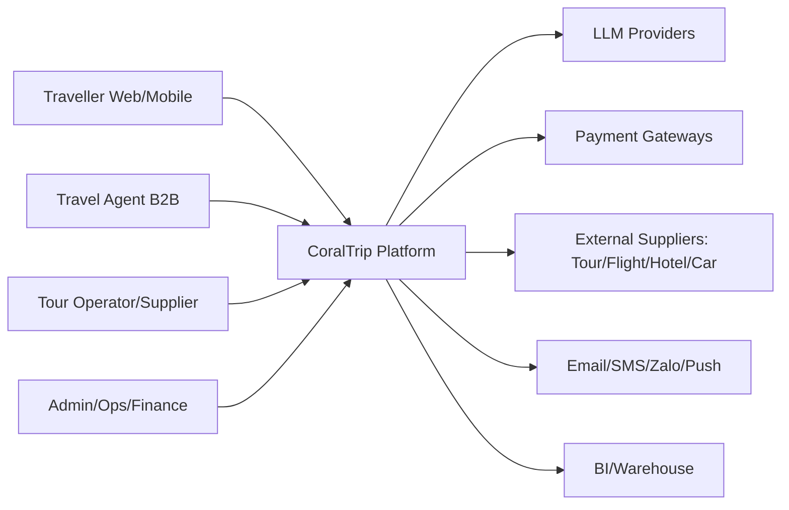
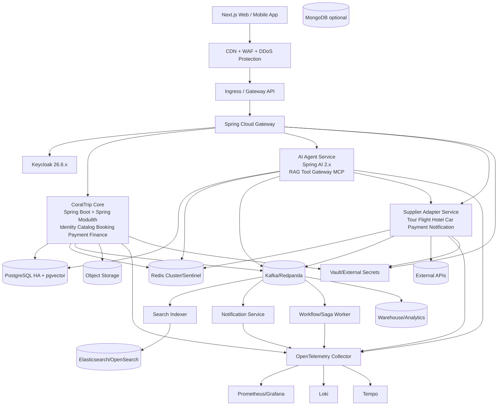
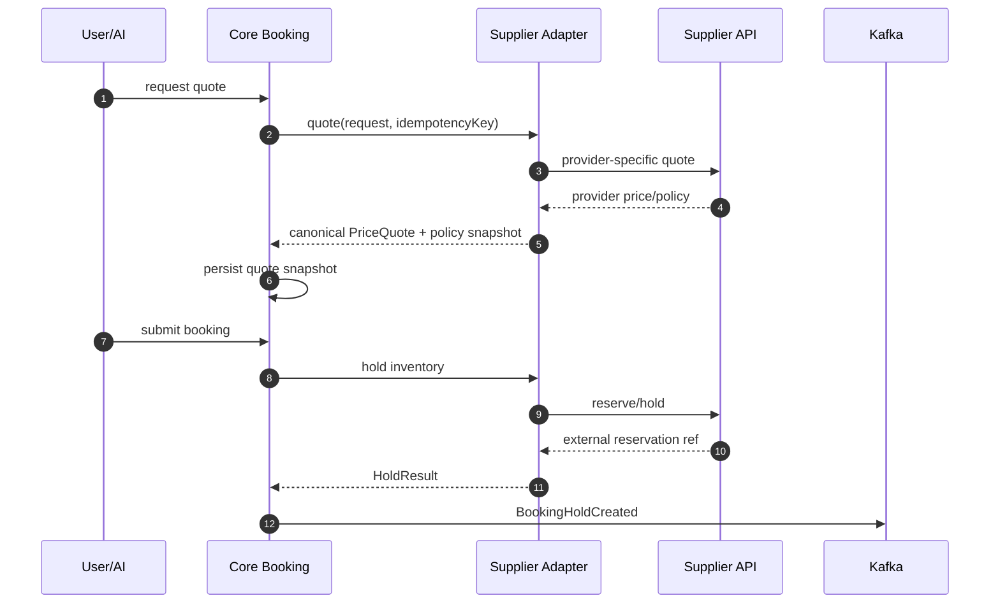
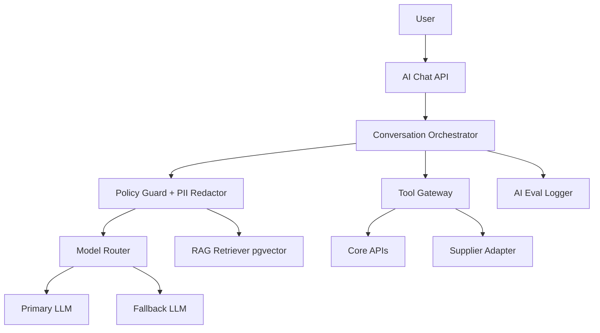
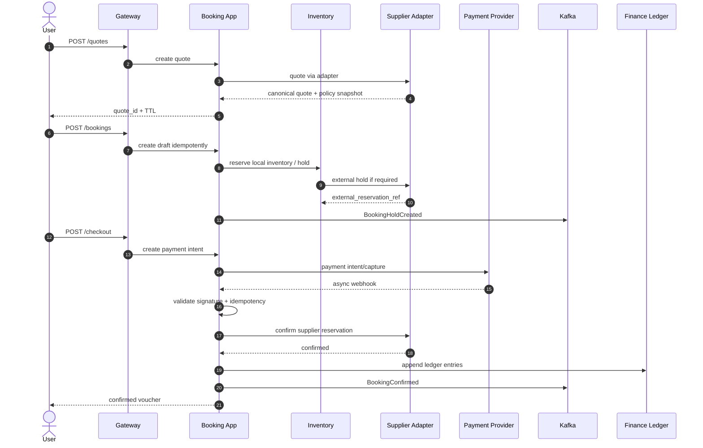

# CoralTrip Assistant Agent — Technical Specification v2.0

> **Loại tài liệu:** Technical Specification (SPEC)  
> **Phiên bản:** v2.0 — Full-scope High-load Architecture Update  
> **Ngày cập nhật:** 03/07/2026 — Asia/Ho_Chi_Minh  
> **Trạng thái:** Revised after technical audit; no MVP architecture; production-grade target from design stage  
> **Đối tượng:** Architect · Backend · Frontend · AI Engineer · SRE · Security · Data · QA  
> **Ngôn ngữ:** Tiếng Việt

---

## 0. Changelog v2.0

| Nhóm | Thay đổi |
|---|---|
| Architecture | Thiết kế theo **high-load modular platform**: modular monolith cho domain core nhưng service boundary rõ; AI Agent, Supplier Adapter, Notification/Workflow có thể deploy tách độc lập. |
| Spring ecosystem | Cập nhật baseline: Java 21 LTS hoặc 25 LTS sau compatibility test; Spring Boot 3.5.x baseline; Spring AI 2.0.0 GA target; Spring Data 2025.x; Spring Security 6.5.x; Keycloak 26.6.x. |
| MCP | Đổi transport chính thành **Streamable HTTP**. SSE cũ chỉ hỗ trợ backward compatibility; production endpoint phải validate Origin, auth, session ID, protocol version. |
| Supplier integration | Tất cả external APIs đi qua **Supplier Adapter Layer** với timeout, retry budget, circuit breaker, rate limit, schema mapping và contract tests. |
| Booking | Bổ sung inventory ledger, quote snapshot, hold TTL, idempotency, distributed consistency, saga orchestration, webhook replay, reconciliation. |
| Observability | Chuẩn OpenTelemetry: traces, metrics, logs, baggage; correlation ID bắt buộc xuyên suốt user → gateway → service → adapter → supplier. |
| Security | Bổ sung OWASP Top 10:2025, OWASP LLM risks, PII redaction trước LLM, policy for tool execution, PCI boundary, data protection controls. |
| Capacity | Thiết kế chịu tải ≥1.000 QPS peak search, ≥5.000 booking/tuần, booking write không oversell, graceful degradation khi LLM/supplier down. |

---

## 1. Architecture principles

1. **Spring ecosystem first:** ưu tiên Spring Boot, Spring Modulith, Spring Security, Spring Data JPA, Spring AI, Spring Kafka, Spring Cloud Gateway, Micrometer, Actuator.
2. **Domain-first:** DDD + hexagonal architecture; domain không phụ thuộc framework; adapter thay đổi được.
3. **High-load from design:** cache strategy, search index, partitioning, idempotency, async outbox, backpressure và rate limit là yêu cầu nền tảng.
4. **No external leakage:** Booking domain không biết chi tiết Amadeus/Booking.com/Agoda/VNPay/MoMo. Mọi provider qua adapter contract.
5. **AI is controlled execution:** AI chỉ đề xuất hoặc gọi tool qua Tool Gateway; mọi financial/destructive action cần user confirmation và policy guard.
6. **Operational readiness:** mỗi service/capability phải có metrics, logs, traces, dashboard, alert, runbook, replay/backfill path.
7. **Compliance by design:** consent, data minimization, privacy rights, PII encryption, retention và audit log không làm sau.

---

## 2. Verified technology baseline

| Layer | Target | Ghi chú |
|---|---|---|
| JDK | Java 21 LTS baseline; Java 25 LTS candidate | Java 21 là lựa chọn ổn định; Java 25 chỉ dùng sau compatibility/perf test với Spring Boot/Spring AI libs. |
| Spring Boot | 3.5.x line, pin patch version by release BOM | Spring release page ngày 25/06/2026 có Spring Boot 3.5.16. |
| Spring AI | 2.0.0 GA target; fallback 1.1.8 nếu dependency risk | Spring release page ngày 12/06/2026 có Spring AI 2.0.0 GA và 1.0.9/1.1.8. |
| Spring Framework/Security/Data | Theo Spring Boot BOM | Không tự nâng lẻ nếu BOM chưa hỗ trợ. |
| Keycloak | 26.6.x | Release notes có Keycloak 26.6.0 với JWT Authorization Grant, federated client authentication, workflows. |
| PostgreSQL | 16/17 with pgvector | OLTP, ledger, outbox, RAG vector store. |
| Redis | 7.x/8.x compatibility tested | Cache, distributed lock, rate limit, session, hot data. |
| Kafka | 3.7+ hoặc Redpanda-compatible after benchmark | Domain events, outbox publishing, search/notification projection. |
| Elasticsearch/OpenSearch | ES 8.x hoặc OpenSearch 2.x | Full-text/filter/ranking. Chọn một để tránh dual support. |
| MongoDB | 7.x/8.x optional | Conversation/audit append-heavy. Có thể dùng Postgres JSONB nếu muốn giảm datastore. |
| Kubernetes | Managed K8s preferred | HPA, PDB, topology spread, network policy, cert-manager, external secrets. |
| Observability | OpenTelemetry + Prometheus/Grafana/Loki/Tempo | OTel supports traces, metrics, logs, baggage. |

---

## 3. System context



### Boundary rule

- User-facing clients chỉ gọi API Gateway.
- AI Agent không gọi trực tiếp DB booking để mutate tài chính; phải gọi Tool Gateway/Application API.
- Supplier APIs không gọi từ Core domain trực tiếp; phải qua Supplier Adapter Service/Module.
- Payment Gateway callback chỉ vào webhook endpoint có signature validation, idempotency và replay support.

---

## 4. Container architecture



### Service/module ownership

| Component | Deployment | Responsibility |
|---|---|---|
| API Gateway | separate | routing, JWT validation, rate limit, request size limit, canary routing. |
| Core | modular monolith first, split-ready | identity projection, catalog, booking, payment orchestration, finance ledger. |
| AI Agent | separate | chat, planning, RAG, tool calling, MCP server/client, model routing, eval logging. |
| Supplier Adapter | separate or module, but boundary strict | external supplier abstraction, contract mapping, retries, circuit breakers, SLA tracking. |
| Workflow/Saga Worker | separate worker | long-running compensation, webhook replay, settlement job, expiry job. |
| Notification | separate worker | email/SMS/Zalo/push, template rendering, idempotent delivery. |
| Search Indexer | separate worker | consume events, update search index, backfill. |

---

## 5. DDD bounded contexts

| Context | Aggregate root | Invariants |
|---|---|---|
| Identity | User, Organization, RoleBinding | email/phone unique; user status; org membership; RBAC/ABAC policy. |
| Consent & Privacy | ConsentRecord, DataSubjectRequest | consent version; explicit opt-in; request SLA; deletion/anonymization audit. |
| Catalog | Tour, Departure, ProductPolicy, MediaAsset | published product has price/policy/media; departure date valid; policy versioned. |
| Supplier | SupplierAccount, SupplierProductMapping | credentials secret-managed; mapping versioned; adapter status monitored. |
| Availability | InventoryLedger, Hold | available seats non-negative; hold TTL; no oversell; external reservation ref unique. |
| Booking | Booking, BookingItem | valid state transitions; quote snapshot; idempotency key unique; pax data complete. |
| Payment | Payment, Refund | webhook idempotency; amount integrity; gateway signature; no double refund. |
| Finance | LedgerEntry, SettlementBatch | immutable ledger; debit/credit balanced; settlement exceptions tracked. |
| AI Agent | Conversation, ToolInvocation, MemoryProfile | tool call audited; financial action confirmed; memory opt-in; PII redacted where needed. |
| Notification | NotificationJob | idempotency per recipient/template/params; retry/DLQ. |
| Search | SearchDocument | projection is rebuildable; versioned index mapping. |
| Ops | Case, ManualOverride | override has reason, role, approval and audit trail. |

---

## 6. Supplier Adapter Layer

### 6.1 Adapter contract

All supplier adapters implement one or more ports:

```java
public interface TravelSupplierAdapter {
    SupplierCode supplierCode();
    SupplierHealth health();
}

public interface SearchAdapter extends TravelSupplierAdapter {
    SearchResult search(SearchCriteria criteria, RequestContext ctx);
}

public interface PricingAdapter extends TravelSupplierAdapter {
    PriceQuote quote(QuoteRequest request, RequestContext ctx);
}

public interface ReservationAdapter extends TravelSupplierAdapter {
    HoldResult hold(HoldRequest request, RequestContext ctx);
    ConfirmResult confirm(ConfirmRequest request, RequestContext ctx);
    CancelResult cancel(CancelRequest request, RequestContext ctx);
}

public interface RefundAdapter extends TravelSupplierAdapter {
    RefundQuote quoteRefund(RefundQuoteRequest request, RequestContext ctx);
    RefundResult refund(RefundRequest request, RequestContext ctx);
}
```

### 6.2 External API handling rules

| Concern | Rule |
|---|---|
| Timeout | Default connect timeout ≤1s, read timeout supplier-specific; hard cap per user request. |
| Retry | Retry only on safe/idempotent operations or with idempotency key. No blind retry on payment capture/confirm. |
| Circuit breaker | Per supplier + per endpoint; open breaker must degrade gracefully. |
| Rate limit | Token bucket per supplier credential and per product. |
| Bulkhead | Separate thread pool/virtual-thread executor and semaphore per supplier. |
| Contract tests | Mock server + real sandbox tests; verify schema drift. |
| Mapping | Provider response mapped into CoralTrip canonical model; preserve raw response in encrypted/audited store if needed. |
| Audit | Log request metadata, not PII/secrets; include supplier latency/status/error code. |

### 6.3 Canonical supplier flow



---

## 7. Data architecture

### 7.1 PostgreSQL schemas

Core transactional data stays in PostgreSQL. Use schema-per-context.

```sql
CREATE SCHEMA IF NOT EXISTS booking;
CREATE SCHEMA IF NOT EXISTS catalog;
CREATE SCHEMA IF NOT EXISTS payment;
CREATE SCHEMA IF NOT EXISTS finance;
CREATE SCHEMA IF NOT EXISTS ai;
CREATE SCHEMA IF NOT EXISTS privacy;

CREATE TABLE booking.bookings (
    id UUID PRIMARY KEY DEFAULT gen_random_uuid(),
    user_id UUID NOT NULL,
    org_id UUID,
    status TEXT NOT NULL,
    product_type TEXT NOT NULL,
    quote_snapshot_id UUID,
    total_amount BIGINT NOT NULL,
    currency CHAR(3) NOT NULL DEFAULT 'VND',
    idempotency_key TEXT NOT NULL,
    created_at TIMESTAMPTZ NOT NULL DEFAULT NOW(),
    updated_at TIMESTAMPTZ NOT NULL DEFAULT NOW(),
    UNIQUE(user_id, idempotency_key)
);

CREATE TABLE booking.inventory_ledger (
    id BIGSERIAL PRIMARY KEY,
    product_id UUID NOT NULL,
    departure_id UUID,
    delta INT NOT NULL,
    reason TEXT NOT NULL,
    booking_id UUID,
    hold_id UUID,
    external_reservation_ref TEXT,
    created_at TIMESTAMPTZ NOT NULL DEFAULT NOW()
);

CREATE TABLE booking.holds (
    id UUID PRIMARY KEY DEFAULT gen_random_uuid(),
    booking_id UUID NOT NULL,
    product_id UUID NOT NULL,
    departure_id UUID,
    quantity INT NOT NULL CHECK (quantity > 0),
    status TEXT NOT NULL CHECK (status IN ('ACTIVE','EXPIRED','CONFIRMED','RELEASED')),
    expires_at TIMESTAMPTZ NOT NULL,
    external_reservation_ref TEXT,
    created_at TIMESTAMPTZ NOT NULL DEFAULT NOW()
);

CREATE TABLE finance.ledger_entries (
    id BIGSERIAL PRIMARY KEY,
    booking_id UUID,
    payment_id UUID,
    settlement_batch_id UUID,
    account TEXT NOT NULL,
    direction TEXT NOT NULL CHECK (direction IN ('DEBIT','CREDIT')),
    amount BIGINT NOT NULL CHECK (amount >= 0),
    currency CHAR(3) NOT NULL DEFAULT 'VND',
    event_id TEXT NOT NULL,
    created_at TIMESTAMPTZ NOT NULL DEFAULT NOW()
);

CREATE TABLE booking.outbox_events (
    id BIGSERIAL PRIMARY KEY,
    aggregate_type TEXT NOT NULL,
    aggregate_id UUID NOT NULL,
    event_type TEXT NOT NULL,
    payload JSONB NOT NULL,
    headers JSONB NOT NULL DEFAULT '{}',
    created_at TIMESTAMPTZ NOT NULL DEFAULT NOW(),
    published_at TIMESTAMPTZ,
    retry_count INT NOT NULL DEFAULT 0
);

CREATE INDEX idx_outbox_unpublished ON booking.outbox_events(created_at) WHERE published_at IS NULL;
CREATE INDEX idx_bookings_user_status ON booking.bookings(user_id, status);
CREATE INDEX idx_holds_expiry ON booking.holds(expires_at) WHERE status='ACTIVE';
```

### 7.2 Partitioning and indexing

| Table | Strategy |
|---|---|
| bookings | Partition by month when write volume grows; index by user/status/created_at. |
| ledger_entries | Append-only; partition by month; immutable. |
| outbox_events | Keep small active partition; archive published events after retention. |
| chat_messages | Partition by month or move to MongoDB if append volume high. |
| audit_logs | Append-only, WORM-capable storage for compliance-sensitive records. |

### 7.3 RAG storage

Use pgvector first for policy/FAQ/visa because source docs are structured and transactional consistency matters. Move to specialized vector DB only if:

- embedding corpus > millions of chunks,
- ANN query latency cannot meet SLO,
- multi-tenant vector isolation becomes complex,
- hybrid search quality requires engine-specific ranking.

---

## 8. API design

### 8.1 REST endpoints

| Method | Path | Auth | Notes |
|---|---|---|---|
| GET | /api/v1/tours | public | catalog search/filter; cacheable. |
| GET | /api/v1/tours/{slug} | public | detail + policy snapshot refs. |
| GET | /api/v1/products/availability | public/user | availability-aware quote input. |
| POST | /api/v1/quotes | USER/AGENT | create price quote snapshot. |
| POST | /api/v1/bookings | USER/AGENT | create draft booking; idempotency required. |
| POST | /api/v1/bookings/{id}/hold | OWNER/AGENT | hold inventory. |
| POST | /api/v1/bookings/{id}/checkout | OWNER/AGENT | create payment intent. |
| POST | /api/v1/bookings/{id}/cancel-quote | OWNER/AGENT | preview refund/cancel. |
| PATCH | /api/v1/bookings/{id}/cancel | OWNER/AGENT/ADMIN | cancel with policy. |
| POST | /api/v1/payments/webhooks/{provider} | provider signed | validate signature + idempotency. |
| POST | /api/v1/ai/chat | USER | streaming response. |
| POST | /mcp | JWT/mTLS | Streamable HTTP MCP endpoint. |
| GET | /mcp | JWT/mTLS | optional server-to-client stream/resume. |
| DELETE | /mcp | JWT/mTLS | optional session termination. |
| GET | /api/v1/admin/bookings | ADMIN/OPS | audit/admin query. |
| GET | /api/v1/finance/reconciliation | FINANCE | settlement exceptions. |

### 8.2 Error envelope

```json
{
  "errors": [
    {
      "id": "trace_01H...",
      "status": "409",
      "code": "INVENTORY_HOLD_CONFLICT",
      "title": "Inventory hold conflict",
      "detail": "Departure dep_123 no longer has 3 seats available.",
      "source": { "pointer": "/data/attributes/pax_count" },
      "meta": {
        "available": 2,
        "retryable": false,
        "correlation_id": "corr_..."
      }
    }
  ]
}
```

### 8.3 Idempotency

- Every booking/payment/supplier-confirm operation requires `Idempotency-Key`.
- Key scope: `actor_id + operation + external_reference`.
- Store request hash and response snapshot.
- If repeated key with different request hash: return 409 `IDEMPOTENCY_KEY_REUSED_WITH_DIFFERENT_PAYLOAD`.

---

## 9. MCP Streamable HTTP design

### 9.1 Transport requirements

Production MCP uses Streamable HTTP:

- MCP endpoint: `/mcp`.
- POST for JSON-RPC messages.
- GET for optional server-to-client stream/resumption.
- Server may issue `MCP-Session-Id` during initialization.
- Client must include `MCP-Session-Id` in subsequent requests if issued.
- Client must include `MCP-Protocol-Version`; default fallback only for backward compatibility.
- SSE legacy endpoint is disabled by default; only enable behind feature flag for old clients.

### 9.2 Security requirements

| Requirement | Implementation |
|---|---|
| Origin validation | Validate `Origin` allowlist for all incoming Streamable HTTP requests. |
| Auth | Bearer JWT for user/developer clients; mTLS for trusted B2B/partner agents. |
| Session | Cryptographically secure `MCP-Session-Id`; bind to user/client/tenant; expire idle sessions. |
| Rate limit | Per user, client, tool, tenant and IP. |
| Tool ACL | Tool registry contains required scopes: `tour:search`, `booking:create`, `booking:cancel`, `payment:quote`. |
| Destructive actions | Require confirmation token generated by UI/application, not by model text alone. |
| Audit | Store tool invocation input/output summary, policy decision, latency, model/provider, actor. |
| PII | Redact/mask sensitive fields before model where possible; never expose secrets to model. |

### 9.3 MCP tools

| Tool | Scope | Confirmation | Notes |
|---|---|---|---|
| `search_tour` | tour:search | No | Read-only. |
| `get_price_quote` | quote:create | No/soft confirm | Creates quote snapshot. |
| `check_availability` | availability:read | No | May call supplier adapter. |
| `create_booking_draft` | booking:create | No financial charge | Draft only. |
| `hold_inventory` | booking:hold | Yes if supplier hold consumes allotment | TTL required. |
| `cancel_booking_quote` | booking:read | No | Preview cancellation/refund. |
| `cancel_booking` | booking:cancel | Yes | Destructive; role/policy check. |
| `create_payment_intent` | payment:create | Yes | Financial action. |

---

## 10. AI architecture



### 10.1 AI guardrails

| Risk | Control |
|---|---|
| Hallucinated tour/price | All inventory recommendations must come from tool result or cached catalog. Response includes `source=catalog/tool`. |
| Prompt injection | Separate system/tool instructions, strip untrusted retrieved instructions, classify malicious input, eval tests. |
| Excessive agency | Tool ACL, confirmation token, allowlist, max tool-call depth, budget cap. |
| Sensitive info disclosure | PII redaction, no secrets in prompt, least-privilege tool responses. |
| Unbounded consumption | Token budget, request/session rate limit, model routing by complexity, cache RAG answers. |
| Wrong policy | RAG must cite policy version; if low confidence, escalate to human. |
| Model/provider outage | Fallback model; degrade to search UI/manual support. |

### 10.2 AI evaluation suite

- Golden dataset: 500 Vietnamese/English user prompts across tour search, policy, refund, visa, group travel, elderly/kids constraints.
- Tool accuracy: correct tool, correct parameters, correct no-tool decision.
- Policy accuracy: answer matches policy source version.
- Price integrity: no price outside quote/tool output.
- Safety: prompt injection, jailbreak, PII exfiltration, destructive action without confirmation.
- Regression threshold: no release if critical safety regression >0 or policy accuracy <98% on golden set.

---

## 11. Booking and payment system design

### 11.1 Core flow



### 11.2 Concurrency model

- For internal allotment: use inventory ledger + materialized availability; write through transaction.
- For concurrent hold: use optimistic locking on availability snapshot + compensating release if external hold fails.
- For external inventory: never assume local availability is final; booking is confirmed only after supplier confirm.
- For high-demand departures: use Redis short lock only as contention reducer, not source of truth.
- For hold expiry: scheduled worker scans `holds` by `expires_at`, emits release events idempotently.

### 11.3 Saga pattern

Use orchestration for booking/payment because business visibility matters.

| Step | Success event | Failure compensation |
|---|---|---|
| Create draft | BookingDraftCreated | Mark draft failed if validation error. |
| Hold inventory | InventoryHeld | Release local/external hold. |
| Create payment | PaymentIntentCreated | Release hold if payment cannot be created. |
| Payment success | PaymentSucceeded | If supplier confirm fails, refund or manual case. |
| Supplier confirm | SupplierConfirmed | If payment captured but supplier fails, auto-refund or Ops case. |
| Voucher issue | VoucherIssued | Retry; Ops case if repeated failure. |

---

## 12. Security and compliance

### 12.1 Identity and access

- Keycloak realm per environment.
- OIDC/OAuth2 with PKCE for web/mobile.
- RBAC + ABAC: role, organization, booking ownership, supplier ownership.
- Service-to-service auth: mTLS or workload identity; JWT audience validation.
- Admin/Ops actions require step-up auth for refund/manual override.

### 12.2 Data protection

| Area | Control |
|---|---|
| Consent | Versioned consent record; purpose-specific; explicit opt-in for AI memory/marketing. |
| PII | Field-level encryption for phone, passport, DOB, payment-adjacent data. |
| Retention | Policy per data class: booking, invoice, chat, audit, logs, marketing consent. |
| Data subject requests | Workflow for access, correction, deletion/anonymization, withdrawal of consent, processing restriction where applicable. |
| Breach | Incident workflow referencing Nghị định 13 Article 23; notification timing and evidence pack reviewed by legal. |
| Cross-border LLM | PII redaction; data transfer risk assessment; provider DPA/security review. |

### 12.3 PCI boundary

- Do not store PAN/card data.
- Prefer redirect/hosted checkout or tokenized payment provider flow.
- Store only payment provider reference, status, amount, currency, masked method metadata.
- Webhook signature validation mandatory.
- If embedded card collection or card-on-file is introduced, perform PCI DSS v4.0.1 scope review before implementation.

---

## 13. Observability and reliability

### 13.1 Telemetry standard

Every request must carry:

- `trace_id`
- `correlation_id`
- `causation_id` for events
- `idempotency_key` if mutation
- `actor_id`, `tenant_id/org_id`
- `booking_id` if applicable
- `supplier_code` if external call
- `model_provider/model_name` if AI call

### 13.2 SLO dashboard

| Dashboard | Key panels |
|---|---|
| Core API | RPS, p50/p95/p99, error rate, DB pool, JVM memory, GC, slow queries. |
| Booking | state transition rate, hold success, oversell count, payment success, webhook retry, compensation rate. |
| Supplier | latency/error by supplier/endpoint, circuit breaker state, rate-limit hit, schema errors. |
| AI | first-token latency, total latency, token cost, tool accuracy, hallucination incidents, fallback rate. |
| Finance | ledger imbalance, settlement exceptions, refund queue, chargeback cases. |
| Infra | pod restarts, HPA, Kafka lag, Redis latency, Postgres replication lag, ES indexing lag. |

### 13.3 Incident priorities

| Severity | Example | Response |
|---|---|---|
| SEV1 | Cannot create/confirm bookings; payment double charge; data breach | Immediate incident commander; freeze risky deploy; customer/ops/legal comms. |
| SEV2 | Search down, supplier adapter major down, AI produces unsafe policy answer | Degrade/fallback; incident channel; postmortem. |
| SEV3 | Single supplier degraded, non-critical dashboard issue | Ticket + monitor. |

---

## 14. Deployment topology

| Workload | Replica target | Scaling signal | Notes |
|---|---:|---|---|
| Gateway | 3–12 | CPU/RPS/p99 | Stateless; PDB min 2. |
| Core | 4–16 | CPU/p99/DB pool | Horizontal scale; connection pool tuned. |
| AI Agent | 3–12 | concurrent sessions/first token latency | Separate HPA; token budget. |
| Supplier Adapter | 3–20 | external call queue/latency | Bulkhead by supplier; canary per supplier. |
| Workflow Worker | 2–8 | queue lag | Idempotent jobs. |
| Notification | 2–8 | queue lag/provider latency | DLQ/retry. |
| Search Indexer | 2–6 | Kafka lag/index latency | KEDA useful. |
| Keycloak | 2–3 | manual/HPA cautious | External Postgres; cache configured. |
| Postgres | 1 primary + ≥2 replicas | manual | HA manager/operator; PITR backup. |
| Redis | 3+ | manual | Sentinel/cluster; AOF if needed. |
| Kafka | 3+ brokers | manual | RF=3; min ISR tuned. |
| Search cluster | 3+ | manual | hot/warm policy. |

### 14.1 Network and security

- NetworkPolicy default deny.
- Only Gateway can receive public traffic.
- Only specific services can call supplier/payment endpoints.
- Secrets via External Secrets/Vault, not K8s plaintext only.
- Image signing/scanning in CI.
- Separate namespaces per environment.

---

## 15. CI/CD and testing strategy

| Test type | Required |
|---|---|
| Unit | Domain invariants, value objects, policy engine. |
| Integration | Postgres, Redis, Kafka, Keycloak, ES, supplier mock via Testcontainers/WireMock. |
| Contract | OpenAPI backward compatibility; supplier adapter contract; MCP tool schema. |
| Load | Search 1.000 QPS peak; booking write with contention; AI chat concurrency. |
| Chaos | Supplier timeout/down, payment webhook delay, Kafka lag, Redis failover, DB read replica lag. |
| Security | SAST, DAST, dependency scan, container scan, secret scan, OWASP Top 10. |
| AI safety | Prompt injection, excessive agency, PII leakage, wrong policy, tool misuse. |
| Reconciliation | Replay webhook, duplicate payment events, refund retry, settlement mismatch. |

---

## 16. Architecture Decision Records

| ADR | Decision |
|---|---|
| ADR-001 | Use Spring ecosystem as primary application platform. |
| ADR-002 | Use modular monolith for core domain with split-ready bounded contexts. |
| ADR-003 | Deploy AI Agent as separate service due to different scale/risk profile. |
| ADR-004 | Use Supplier Adapter Layer for all external supplier/payment/notification integrations. |
| ADR-005 | Use MCP Streamable HTTP for production MCP transport. |
| ADR-006 | Use PostgreSQL as transactional source of truth; pgvector for RAG initially. |
| ADR-007 | Use Kafka/outbox for event-driven projections and async workflows. |
| ADR-008 | Use Keycloak + Spring Security for OIDC/OAuth2/RBAC. |
| ADR-009 | Avoid storing PAN/card data; keep PCI scope limited through hosted/tokenized payment flow. |
| ADR-010 | Use OpenTelemetry standard for traces/metrics/logs/baggage. |

---

## 17. Capacity model

### 17.1 Traffic assumptions

| Input | Target |
|---|---:|
| Search/day | 200.000 |
| Peak search QPS | 1.000 with cache/search index |
| Booking/week | 5.000 |
| Booking/day average | ~714 |
| AI sessions/day | 20.000–50.000 scenario range |
| Supplier calls/search | 0–N depending cache and product; avoid supplier fan-out on every user search. |

### 17.2 Design implications

- Search must be served primarily by local index/cache, not live fan-out to suppliers.
- Supplier fan-out only for quote/availability refinement or background refresh.
- Booking writes are low QPS compared with search but high correctness risk; prioritize consistency over latency.
- AI cost/latency controlled by prompt caching, RAG cache, model routing, and only calling supplier tools when needed.
- Use backpressure: queue or degrade AI/supplier-heavy actions before harming booking/payment core.

---

## 18. References

1. Spring releases: https://spring.io/blog/category/releases/  
2. Spring AI MCP Streamable HTTP server: https://docs.spring.io/spring-ai/reference/api/mcp/mcp-streamable-http-server-boot-starter-docs.html  
3. Spring AI MCP overview: https://docs.spring.io/spring-ai/reference/api/mcp/mcp-overview.html  
4. MCP Streamable HTTP transport 2025-11-25: https://modelcontextprotocol.io/specification/2025-11-25/basic/transports  
5. MCP Streamable HTTP transport 2025-03-26: https://modelcontextprotocol.io/specification/2025-03-26/basic/transports  
6. Keycloak release notes: https://www.keycloak.org/docs/latest/release_notes/index.html  
7. Booking.com Demand API: https://developers.booking.com/demand  
8. Booking.com Demand API Authentication: https://developers.booking.com/demand/docs/development-guide/authentication  
9. Amadeus for Developers: https://developers.amadeus.com/  
10. OWASP Top 10:2025: https://owasp.org/www-project-top-ten/  
11. OpenTelemetry Signals: https://opentelemetry.io/docs/concepts/signals/  
12. Nghị định 13/2023/NĐ-CP: https://thuvienphapluat.vn/van-ban/Cong-nghe-thong-tin/Nghi-dinh-13-2023-ND-CP-bao-ve-du-lieu-ca-nhan-465185.aspx
